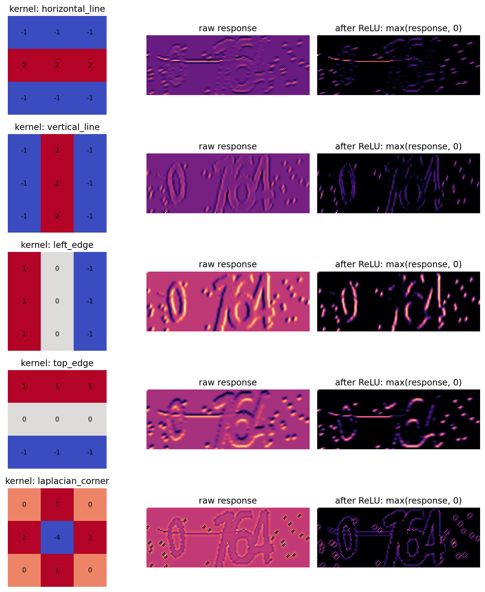
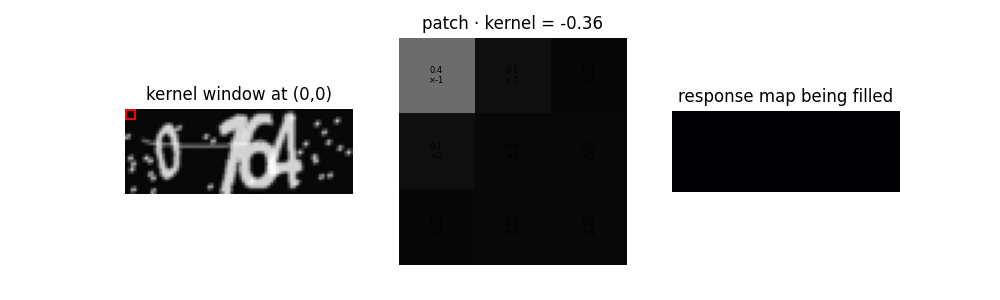
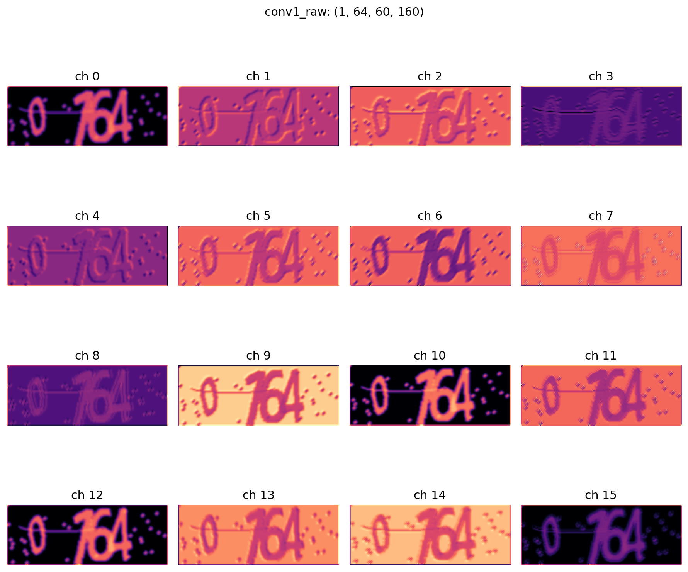

# CNN 卷积核

> 版本：2026-05-13  
> 本节目标：先不急着讲完整 CNN。  
> 本节只解决一个问题：**卷积核到底是什么？它为什么可以提取图像特征？**  
>
> 读者定位：  
> - 网安院同学`pwnnofans`：已经做过 CNN 验证码识别实验，但希望把每一层作用讲清楚。  
> - 数学院同学`屠狗`：可能没有计算机图像处理基础，因此本节会先解释像素、颜色数值、局部窗口、卷积核、特征图、通道等概念。  
>
> 本节之后再自然过渡到：为什么只有卷积层仍然不够？为什么需要激活层？为什么需要池化、归一化、多层堆叠？

---

## 1. 从线性模型的失败引入 CNN

上一章我们用最简单的线性模型解释了一次机器学习训练过程：

$$
\hat{y} = w^T x + b
$$

如果把一张验证码图片拉平成向量：

$$
x = [x_1, x_2, \ldots, x_d]^T
$$

那么线性模型相当于：

$$
\hat{y}
=
w_1x_1 + w_2x_2 + \cdots + w_dx_d + b
$$

也就是：

> 给每个像素位置分配一个固定权重，然后加权求和。

这个模型可以帮助我们理解训练、损失和梯度下降，但它不适合验证码识别。

原因是验证码图片中的关键信息不是某一个孤立像素，而是很多相邻像素共同形成的结构，例如：

- 横线
- 竖线
- 斜线
- 弯曲笔画
- 字符轮廓
- 局部空洞
- 字符之间的位置关系

如果直接把图片拉平成向量，原本相邻的像素关系会被弱化。模型只能看到：

- 第 1 个像素
- 第 2 个像素
- 第 3 个像素
- ...

而不自然知道：

- 这些像素在图像上彼此相邻（只知道在 W 方向上相邻）；
- 这几个相邻像素共同形成了一条竖线等结构；
- 这些横线、竖线、弯曲结构组合成了字符。

因此，我们需要一种更符合图像结构的模型。

CNN，也就是卷积神经网络，正是基于这个想法：

> 图像中的**局部邻域**很重要；  
> 同一种局部模式可能出现在不同位置；  
> 低级局部模式可以逐层组合成更高级的视觉结构。

这就是 CNN 的核心假设。

**PS：听说卷积核和数学中的卷积已经没有太大的关系了，但是他们还是有共同的性质，你能在学完这一节之后找出来么。@屠狗**

---

## 2. 为了提取局部特征，引入卷积核（Convolutional Kenel）

为了识别验证码，模型不能只问：

> 第 137 个像素是不是黑的？

它更应该问：

> 这一小片区域是不是像一条横线？  
> 这一小片区域是不是像一条竖线？  
> 这一小片区域是不是像字符边缘？  
> 这一小片区域是不是像某种笔画结构？

也就是说，图像识别的第一步不是直接识别完整字符，而是先提取局部特征。

因此我们引入一个概念：**卷积核 kernel**

卷积核可以先直观理解为：

> 一个小的局部模板，用来检测图片中某种局部模式是否出现。

例如：

- 横线卷积核：检测横向笔画；
- 竖线卷积核：检测竖向笔画；
- 边缘卷积核：检测明暗突变；
- 轮廓卷积核：检测字符边界。

在真正的 CNN 中，这些卷积核不是人手写的，而是模型通过训练自动学习出来的。  
但为了理解卷积核的工作原理，我们先看几个**人手写的卷积核**。

---

## 3. 先理解像素值：图像在计算机里是什么？

一张灰度图可以看成一个矩阵：

$$
X \in \mathbb{R}^{H \times W}
$$

其中：

- $H$ 是图像高度；
- $W$ 是图像宽度；
- 矩阵中每个元素是一个像素值。

**灰度图中，每个像素值表示亮度。**

常见表示方式有两种。

- 0   = 黑色
- 255 = 白色
- 中间值 = 不同程度的灰色

### 3.2 0 到 1 表示

机器学习中常常把像素值除以 255，归一化到：

$$
[0,1]
$$

此时：

- 0 = 黑色
- 1 = 白色

有时为了让“黑色笔画”成为高数值，也会反色：

- 原图：黑色字符 = 低值，白色背景 = 高值
- 反色后：黑色字符 = 高值，白色背景 = 低值

后面的可视化中使用的是反色后的图像，所以图中说明为`black strokes as high values`：

也就是：

> 黑色笔画被转成了高数值区域。

这样做只是为了让卷积响应图更直观，不改变卷积本质。

---

## 4. 局部窗口 patch：卷积核每次只看一小块

**卷积核不会一次看完整张图，而是每次只看一个小区域。从而分析该区域的局部特征。**

这个小区域叫：**局部窗口 patch**

如果卷积核大小是 $3 \times 3$，那么它每次会盖住图像上的一个 $3 \times 3$ 小块。

这个小块可以写成：

$$
P =
\begin{bmatrix}
p_{11} & p_{12} & p_{13} \\
p_{21} & p_{22} & p_{23} \\
p_{31} & p_{32} & p_{33}
\end{bmatrix}
$$

其中每个 $p_{ij}$ 都是当前局部区域中的一个像素值。

直观理解：

> **patch 是当前被观察的那一小块图片。**

在验证码里，一个 patch 可能刚好覆盖：

- 一小段横线；
- 一小段竖线；
- 一个字符边缘；
- 一小块背景；
- 一个噪点；
- 一个笔画转折处。

---

## 5. 卷积核 kernel：用一个小模板检测 patch

与 patch 大小相同，我们定义，**用于观察图像patch的特征** 的 **量化方式 为一个 $3 \times 3$ 的卷积核 kernel**：

$$
K =
\begin{bmatrix}
k_{11} & k_{12} & k_{13} \\
k_{21} & k_{22} & k_{23} \\
k_{31} & k_{32} & k_{33}
\end{bmatrix}
$$

它的作用是：

> 判断当前 patch 和这个 kernel 所代表的模板是否匹配。

计算方式是：

$$
R
=
p_{11}k_{11}
+
p_{12}k_{12}
+
\cdots
+
p_{33}k_{33}
$$

更紧凑地写：

$$
R
=
\sum_{i=1}^{3}
\sum_{j=1}^{3}
p_{ij}k_{ij}
$$

这里的 $R$ 是一个数，表示：当前 `patch` 对这个卷积核的`响应值 response`

所以：

> patch 表示当前局部图像内容；  
> kernel 表示要检测的局部模式；  
> response 表示当前局部区域和该模式的匹配分数。

为了简洁，有时会写：

$$
R = P \cdot K
$$

**但这里的点乘不是矩阵乘法，而是：**对应位置相乘，然后全部加起来。

这可以理解为一种局部内积。

**PS：你如何理解这里的内积定义的合理性与后面的检测原理的关系 @屠狗**

---

## 6. 横线卷积核：为什么能检测横线？

考虑这个卷积核：

$$
K_{\text{horizontal}}
=
\begin{bmatrix}
-1 & -1 & -1 \\
2 & 2 & 2 \\
-1 & -1 & -1
\end{bmatrix}
$$

它的结构是：

- 上面一行：负权重
- 中间一行：正权重，而且数值较大
- 下面一行：负权重

所以它表达的偏好是：

> 如果当前 patch 的中间一行很强，上下两行较弱，那么响应值会很大。

这正好对应横线。

假设当前 patch 是一条横线：

$$
P_{\text{horizontal}}
=
\begin{bmatrix}
0 & 0 & 0 \\
1 & 1 & 1 \\
0 & 0 & 0
\end{bmatrix}
$$

计算响应：

$$
P_{\text{horizontal}} \cdot K_{\text{horizontal}}
=
0(-1)+0(-1)+0(-1)
+
1(2)+1(2)+1(2)
+
0(-1)+0(-1)+0(-1)
=
6
$$

响应很大，说明：

> 这个 patch 很像横线。

如果当前 patch 是竖线：

$$
P_{\text{vertical}}
=
\begin{bmatrix}
0 & 1 & 0 \\
0 & 1 & 0 \\
0 & 1 & 0
\end{bmatrix}
$$

那么：

$$
P_{\text{vertical}} \cdot K_{\text{horizontal}}
=
0(-1)+1(-1)+0(-1)
+
0(2)+1(2)+0(2)
+
0(-1)+1(-1)+0(-1)
=
0
$$

响应不强，说明：

> 这个 patch 不像横线。

这就是卷积核提取图像局部特征的核心原理。

---

## 7. 用固定卷积核观察验证码

下面这张图展示了几种人工设计的卷积核，以及它们扫过验证码后的结果。



每一行由三部分组成：

- 左：卷积核 kernel
- 中：raw response，也就是原始响应图
- 右：after ReLU，也就是把负响应置零后的结果（暂时不用管它，这节不涉及）

其中：

### 7.1 horizontal_line

它主要检测横向结构。可以看到验证码中的横向干扰线、字符中的横向笔画会被高亮。

### 7.2 vertical_line

它主要检测竖向结构，所以字符中接近竖直的笔画会被高亮。

### 7.3 left_edge

**它比较左侧和右侧的亮度差异**，所以它更像方向性边缘检测器，而不是简单竖线检测器。

### 7.4 top_edge

它比较上方和下方的亮度差异。所以它检测某一方向的水平边界。

### 7.5 laplacian_edge

图中标成 `laplacian_corner`，但更准确应叫 `laplacian_edge`

它的核是：

$$
\begin{bmatrix}
0 & 1 & 0 \\
1 & -4 & 1 \\
0 & 1 & 0
\end{bmatrix}
$$

它比较中心点和上下左右邻居的差异，**因此对灰度突变很敏感。**

所以它会把字符轮廓、噪点边界、干扰线边界都勾勒出来。

**PS：灰度突可以理解为亮度突变，即某个点四周的亮度值与中间点的亮度差异很大。@屠狗**

---

## 8. 卷积核的工作方式：平移 + 计算

当然，在上述定义中，卷积只看了 $3 \times 3$ 像素的区域，一般的图像有$1080 \times 1920$像素。

因此提取整个图像的特征，必须让卷积核看完整个图像，在整张图上滑动。

这个过程可以理解成：

- 第 1 步：把卷积核放到图像左上角。
- 第 2 步：取出当前 `patch`。
- 第 3 步：计算 `patch · kernel`，得到一个 response，将`responose` 存入另一个图结构`response map`。
- 第 4 步：把卷积核向右移动。
- 第 5 步：重复计算。
- 第 6 步：一行扫完后，换下一行。
- 第 7 步：直到扫完整张图。

动态过程如下：



这张图中（pdf中无法显示 gif，请查看./cnn_visual_outputs/02_convolution_scanning.gif）：

- 左边红框：当前卷积核盖住的 patch；
- 中间：当前 patch 和 kernel 的乘加计算；
- 右边：每个位置计算出的 response 逐渐组成一张图 `response map`。

扫完整张图之后，所有 response 按空间位置排列，最终的`response map`形成 `feature map`：

**如果使用的是横线卷积核，这张特征图就表示：**

> **图片中每个位置像不像横线。**

**如果使用的是竖线卷积核，这张特征图就表示：**

> **图片中每个位置像不像竖线。**

---

## 9. 一个卷积核只能提取一种视角

上述方法只能够解决单一的线性轮廓分配问题。（你当然可以选择增大卷积核的边长，定义看似是曲线的轮廓，但是也只有一种视角）

一个横线卷积核只能检测横线。

一个竖线卷积核只能检测竖线。

一个边缘卷积核只能检测某类边界。

但验证码中有很多不同结构：

- 横线
- 竖线
- 斜线
- 弯曲
- 圆弧
- 闭合区域
- 交叉点
- 噪声点
- 背景纹理

**因此，一层 CNN 通常不会只有一个卷积核，而是会有很多个卷积核。**

**如果一层有 64 个卷积核，那么它会生成 64 张特征图。**

**这些特征图堆叠起来，形成一个三维张量：**
$$
Y \in \mathbb{R}^{64 \times H' \times W'}
$$

其中：

- 64：**输出通道数**，也就是 64 个卷积核产生的 64 张特征图。
- H'：特征图高度。
- W'：特征图宽度。
- **其中  $1 \times H' \times W'$为一个通道 channel**，也就是一种**特征响应图**。

PS：这里 H、W 和 H' 、W'的关系暂时先不考虑，之后学完 CNN 有正确的表达式。@屠狗

---

## 10. 通道 channel

在可视化图中常常会看到：`ch 0、ch 1、ch 2`

这里的 `ch` 是 channel 的缩写，意思是通道。

如果第一层有 64 个卷积核，那么输出有 64 个通道：

每个通道都可以理解为：

> 模型用一种不同的局部特征检测器观察图片后的结果。

如果是人工卷积核：

- horizontal_line kernel → 横线响应图
- vertical_line kernel → 竖线响应图
- left_edge kernel → 左边缘响应图

**如果是训练好的 CNN：**

- ch 0 → 模型学到的第 0 种局部特征响应
- ch 1 → 模型学到的第 1 种局部特征响应
- ...

**这些特征不一定都有人工可命名的含义。**

**第一层可能还比较像边缘、线条、明暗变化。 
更深层的通道则可能表示多个低级特征组合出的复杂结构。**

---

## 11. 第一次卷积结果：多个卷积核提取不同特征

下面这张图展示的是**训练后 CNN 第一层卷积**的若干通道输出。



可以看到，每个 `ch` 都像是用不同滤镜处理过的验证码。

这说明：

> 第一层的多个卷积核在同一张图片上提取了不同特征。

有的通道更关注字符笔画；

有的通道更关注边缘；

有的通道更关注背景和字符的对比；

有的通道对噪点也有响应。

这里不要强行给每个通道命名。

更合理的理解是：

> **每个通道是一张“某种局部模式的响应图”。**

这和前面人工卷积核的原理相同，只是这里的卷积核不是人手写的，而是训练中学出来的。

---

## 12. 卷积层的数学形式

**对单通道图像：**
$$
X \in \mathbb{R}^{H \times W}
$$

一个卷积核：

$$
K \in \mathbb{R}^{r \times s}
$$

输出特征图：

$$
Y \in \mathbb{R}^{H' \times W'}
$$

在位置 $(u,v)$ 的输出为：

$$
Y(u,v)
=
\sum_{i=0}^{r-1}
\sum_{j=0}^{s-1}
X(u+i,v+j)K(i,j)
+
b
$$

其中：

- $r,s$ 是卷积核大小；
- $b$ 是偏置项；
- $(u,v)$ 是卷积核当前扫到的位置。

如果有多个卷积核，就有多个输出通道。

设第 $o$ 个卷积核为 $K_o$，则：

$$
Y_o(u,v)
=
\sum_{i=0}^{r-1}
\sum_{j=0}^{s-1}
X(u+i,v+j)K_o(i,j)
+
b_o
$$

其中：

$$
o 表示第 o 个输出通道
$$


**如果输入本身有多个通道，例如 RGB 图像：**
$$
X \in \mathbb{R}^{C_{\text{in}} \times H \times W}
$$

那么第 $o$ 个输出通道为：

$$
Y_o(u,v)
=
\sum_{c=1}^{C_{\text{in}}}
\sum_{i=0}^{r-1}
\sum_{j=0}^{s-1}
X_c(u+i,v+j)K_{o,c}(i,j)
+
b_o
$$

也就是说：

> **每个输出通道会同时看所有输入通道。**

**PS：你能够给这里偏置项的意义一个比较合理的解释么？@屠狗**

---

## 13. 卷积核不只用于识别横线和竖线

前面的横线、竖线卷积核只是为了帮助理解。

真实 CNN 学到的卷积核可以更丰富。

在图像中，卷积核可以检测：

- 亮度变化
- 颜色变化
- 边缘方向
- 局部纹理
- 轮廓
- 角点
- 重复图案
- 局部形状

在不同任务中，卷积核也不只用于图片。

因为卷积的核心思想是：

> 在局部邻域中寻找可重复出现的模式。

所以只要数据中存在“局部模式”，就可能使用卷积思想。

例如：

### 13.1 一维序列

如果数据是序列：

$$
x = [x_1,x_2,\ldots,x_n]
$$

一维卷积核可以检测局部连续片段。

应用包括：

- 语音信号
- 时间序列
- 传感器数据
- 文本字符序列
- 机器码 byte 序列

### 13.2 二维图像

二维卷积核检测图像局部结构。

应用包括：

- 字符识别
- 人脸识别
- 医学图像
- 目标检测
- 验证码识别

### 13.3 三维数据

三维卷积可以处理：

- 医学 CT
- 视频片段
- 三维体素数据

所以卷积核并不等于“图像专用工具”。

更抽象地说：

> **卷积核是一种局部模式检测器。** 
> **它适合处理那些局部结构重要、并且局部模式可以在不同位置重复出现的数据。**

---

## 14. 如何将这些特征层组合成可表达的字节序列？

现在我们已经得到了 `Channels`个输出特征图了，那么如何将这些特征转换为具体字符呢？

假设某一层卷积输出为：
$$
A \in \mathbb{R}^{B \times C_{\text{feat}} \times H' \times W'}
$$
其中：

- $B$ 表示一次输入的图片数量，也就是 batch size；
- $C_{\text{feat}}$ 表示特征通道数，也就是这一层输出了多少张特征图；
- $H'$ 表示每张特征图的高度；
- $W'$ 表示每张特征图的宽度。

由于分类是一维的的向量（见上一节`logits`），因此我们需要将它展成一维向量。（怎么线性展开都行，全连接层会进行矩阵变换）

这个操作叫：

- Flatten：展平

**具体来说，就是把所有通道、所有空间位置上的特征值按某种固定顺序排成一个长向量：**
$$
h
=
\text{Flatten}(A)
$$
也就是说，这一张图片现在不再是一张原始像素图，而是变成了：
$$
h = [h_1,h_2,\ldots,h_d]^T,d=C_{feat}​×H′×W′
$$

如果要待分类个数为 $C$ ，可以用一个线性分类器：

$$
z = Wh + b
$$

其中：

$$
W \in \mathbb{R}^{C \times d}
$$

$$
b \in \mathbb{R}^{C}
$$

$$
z \in \mathbb{R}^{C}
$$

**这里的 $z$ 叫做 logits，也就是每个类别的原始分数。**

第 $k$ 类的分数是：

$$
z_k = w_k^T h + b_k
$$

模型预测时选择分数最大的类别：

$$
\hat{y} = \arg\max_k z_k
$$

**如果要转成概率，可以使用 softmax：**
$$
p_k
=
\frac{e^{z_k}}
{\sum_{j=1}^{C}e^{z_j}}
$$

所以全连接层的作用是：

> 根据前面提取出的特征，给每个类别打分。

在验证码中，一个字符位置有 36 类：`0-9 和 a-z`

所以每个字符位置都需要输出 36 个分数。

那么目前为止，我们提取的这些特征就已经被我们转成了每一个是字符的概率。

而我们需要训练的参数就是所有卷积核$K_i$、卷积核偏置项$b_i$，全连接层矩阵$W$，全连接层偏置项$b_i$

PS：全连接是如何将输出的多种特征最终组合成字符分类的？@屠狗

---

## 15. 只有卷积层 + 全连接层实验

前面我们已经知道，卷积核可以提取局部特征。

- 卷积核会在图像上滑动；
- 每次覆盖一个局部窗口 `patch`；
- 通过 `patch · kernel + b` 得到一个响应值；
- 多个卷积核会生成多个特征图；
- 这些特征图再交给后面的分类器做判断。

为了验证“只有卷积核是否足够”，我们构造了一个非常简单的对照模型：

```python
import torch
import torch.nn as nn

class ConvOnlyCaptcha(nn.Module):
    def __init__(self, captcha_length=4, num_classes=36):
        super().__init__()

        # 只有卷积层，没有 ReLU、没有池化、没有 BatchNorm
        self.conv = nn.Conv2d(
            in_channels=1,
            out_channels=16,
            kernel_size=3,
            padding=1
        )

        # 假设输入图片大小是 60×160
        self.classifier = nn.Linear(
            16 * 60 * 160,
            captcha_length * num_classes
        )

        self.captcha_length = captcha_length
        self.num_classes = num_classes

    def forward(self, x):
        h = self.conv(x)
        h = h.view(h.size(0), -1)
        z = self.classifier(h)
        z = z.view(-1, self.captcha_length, self.num_classes)
        return z
```

这个模型只有：

- 卷积层；
- Flatten 展平；
- 全连接层分类。

它故意没有加入：

- ReLU 激活函数；
- 池化层；
- BatchNorm 归一化；
- 多层卷积堆叠。

所以它可以帮助我们观察：

> 只有“局部线性特征提取 + 线性分类器”时，模型到底能做到什么程度？

---

### 15.2 问题思考：卷积核能提取特征，但能不能直接完成验证码识别？

我们希望通过这个实验回答两个问题：

- 卷积核是否真的学到了一些局部图像模式？
- 如果没有激活函数和多层组合，模型能否稳定识别 4 位验证码？

本次实验的最终验证集结果为：

- 验证集 loss：`3.049005`
- 字符级准确率 `char_accuracy`：`29.67%`
- 整体验证码准确率 `captcha_accuracy`：`0.58%`

这里要区分两个准确率：

- 字符级准确率：4 个字符中，每个字符单独算对不对。
- 整体验证码准确率：必须 4 个字符全部预测正确，才算整张验证码正确。

所以即使字符级准确率接近 `30%`，整体验证码准确率仍然可能非常低。

因为 4 个字符必须同时正确，难度会明显增加。

---

### 15.3 输入样本：模型看到的仍然只是像素矩阵


这张图是本次用于可视化的输入样本。

真实标签是：

- `0152`

对人来说，我们能直接看出图中大概是 `0152`。

但对模型来说，这张图仍然只是一个灰度像素矩阵：

$$
X \in \mathbb{R}^{1 \times 60 \times 160}
$$

其中：

- `1` 表示灰度图通道；
- `60` 表示高度；
- `160` 表示宽度。

图像里包含：

- 主体字符；
- 灰度变化；
- 干扰点；
- 干扰线；
- 字符边缘；
- 背景与笔画之间的亮度差。

卷积层接下来会用 16 个不同的 $3 \times 3$ 卷积核去扫描这张图。

---

### 15.4 学到的卷积核：模型形成了 16 个局部模板


这张图展示了训练后模型学到的 16 个卷积核。

每个卷积核都是一个 $3 \times 3$ 小矩阵。

第 $o$ 个卷积核可以写成：

$$
K_o =
\begin{bmatrix}
k_{11} & k_{12} & k_{13} \\
k_{21} & k_{22} & k_{23} \\
k_{31} & k_{32} & k_{33}
\end{bmatrix}
$$

它在图像上滑动时，每次会对一个局部窗口计算：

$$
R_o(u,v)
=
\sum_{i=1}^{3}
\sum_{j=1}^{3}
P_{u,v}(i,j)K_o(i,j)
+
b_o
$$

其中：

- $P_{u,v}$ 是图像在位置 $(u,v)$ 处的局部窗口；
- $K_o$ 是第 $o$ 个卷积核；
- $R_o(u,v)$ 是该卷积核在该位置的响应值；
- $b_o$ 是该卷积核对应的偏置。

从图中可以看到，这些卷积核并不是完全随机的。

有些核出现了明显的正负权重分布：

- 某些位置为正；
- 某些位置为负；
- 某些核可能偏向检测局部亮暗变化；
- 某些核可能偏向检测边缘或笔画方向。

但是要注意：

> 这些卷积核只有 $3 \times 3$，它们本身并不能识别完整字符，只能检测非常局部的模式。

也就是说，卷积核可以发现“这里有某种局部结构”，但还不能直接判断“这是数字 0、1、5、2”。

---

### 15.5 卷积层输出：16 个通道对应 16 张响应图


这张图是卷积层输出的 16 个通道。

输入图片经过 16 个卷积核后，得到：

$$
A \in \mathbb{R}^{16 \times 60 \times 160}
$$

其中：

- `ch 0` 是第 0 个卷积核扫完整张图后的响应图；
- `ch 1` 是第 1 个卷积核扫完整张图后的响应图；
- 依此类推；
- `ch 15` 是第 15 个卷积核的响应图。

这些通道不是 16 个独立分类结果。

它们只是 16 种不同的局部特征响应。

可以观察到：

- **有些通道保留了较完整的字符轮廓；**
- **有些通道更突出字符边界；**
- **有些通道对干扰点也有明显响应；**
- **有些通道整体偏亮或偏暗，说明该卷积核对背景和字符的响应方向不同。**

这说明：

> 即使只有一层卷积，模型也确实能把同一张图变成多个不同视角的特征图。

但是这些特征图仍然非常接近原图。

**这说明它们大多还停留在低级视觉特征阶段，例如**：

- 边缘；
- 亮暗变化；
- 局部笔画；
- 噪声响应；
- 字符轮廓。

它们还没有形成更高级的字符结构理解。

---

### 15.6 正负响应图：没有 ReLU 时，正负信号会同时保留


这张图和上一张图观察的是同一个卷积层输出，但显示方式不同。

这里用冷暖色表示正负响应：

- 暖色表示正响应；
- 冷色表示负响应；
- 接近灰色表示响应接近 0。

由于这个模型没有 ReLU，所以卷积层输出不会被截断。

也就是说，卷积后的结果同时保留：

$$
R_o(u,v) > 0
$$

和：

$$
R_o(u,v) < 0
$$

两种情况。

这就带来一个问题：

> **卷积核虽然检测到了局部模式，但模型没有明确地“激活”某种模式，也没有压制反向响应。**

如果加入 ReLU，则会变成：

$$
\text{ReLU}(R_o(u,v)) = \max(0, R_o(u,v))
$$

也就是：

- **正响应保留；**
- **负响应置零。**

因此，ReLU 可以理解为：

> 对卷积核检测到的模式进行一次非线性筛选。

**这正是下一节要引入激活层的原因。**

---

### 15.7 logits 热力图：全连接层如何给 4 个字符位置打分


这张图展示了模型最终输出的 logits。

logits 是 softmax 之前的原始类别分数。

因为验证码有 4 个字符位置，每个位置有 36 个候选类别，所以输出是：

$$
Z \in \mathbb{R}^{4 \times 36}
$$

图中：

- 横轴是类别编号；
- `0-9` 对应数字；
- 后面继续对应 `a-z`；
- 纵轴是字符位置；
- `pos 1` 表示第 1 个字符；
- `pos 2` 表示第 2 个字符；
- `pos 3` 表示第 3 个字符；
- `pos 4` 表示第 4 个字符。

图标题显示：

- `true=0152`
- `pred=czya`

也就是说：

- 真实验证码是 `0152`；
- 模型预测成了 `czya`。

这说明：

> 模型确实给每个字符位置都输出了 36 类分数，但最高分对应的类别并不正确。

从图上可以看到，每一行都有若干较亮的位置，表示模型对这些类别给出了较高分数。

但是这些高分并没有稳定落在真实类别上。

这说明：

> 只有卷积 + 全连接时，模型能够形成某些局部响应，但这些响应还不足以稳定区分完整字符。

---

### 15.8 动态扫描图：学到的卷积核如何在图像上工作


这张 GIF 展示的是训练后第 0 个卷积核在图像上滑动的过程。

每一步都在做：

$$
\text{patch} \cdot \text{kernel} + b
$$

也就是：

$$
R(u,v)
=
\sum_{i=1}^{3}
\sum_{j=1}^{3}
P_{u,v}(i,j)K(i,j)
+
b
$$

图中：

- 左侧红框表示当前卷积核覆盖的局部窗口；
- 中间显示当前 patch 与 kernel 的乘加计算；
- 右侧逐渐填充 response map。

这张图再次说明：

> 卷积层不是一次性理解整张图，而是用同一个局部模板在整张图上反复扫描。

这体现了 CNN 的两个基本思想：

- 局部性：每次只看一个小邻域；
- 参数共享：同一个卷积核在所有位置复用。

但是，当前模型的问题也正在这里：

> 它只是把局部响应收集起来，然后交给一个线性分类器。  
> 它缺少非线性筛选，也缺少多层组合。

---

### 15.9 为什么这个模型准确率有限？

现在我们可以回到核心问题：

> 为什么只有卷积层 + 全连接层还不够？

这个模型的问题是：

> 从输入到输出，整体仍然主要是线性变换的复合。

卷积是线性的，全连接层也是线性的。

如果中间没有 ReLU 这样的非线性函数，那么整体表达能力有限。

数学上可以这样理解。

卷积层可以看成一个线性变换：

$$
h = Ax
$$

全连接层也是线性变换：

$$
z = Wh + b
$$

代入：

$$
z = W(Ax) + b
$$

也就是：

$$
z = (WA)x + b
$$

所以如果没有激活函数，中间即使有卷积层，本质上仍然接近一个大的线性分类器。

它可能学到：

- 某些边缘位置和类别有关；
- 某些笔画响应和类别有关；
- 某些背景噪声模式和类别有关。

但它很难稳定处理：

- 字符扭曲；
- 噪声干扰；
- 笔画遮挡；
- 字符偏移；
- 多个局部结构之间的复杂组合关系。

这也和本次实验结果一致。

最终验证集结果为：

- 验证集 loss：`3.049005`
- 字符级准确率：`29.67%`
- 整体验证码准确率：`0.58%`

这说明：

> 模型确实学到了一部分局部规律，但远远没有形成足够稳定的 4 位验证码识别能力。

训练记录中：

- 第 1 轮训练 loss 为 `9.5276`，验证 loss 为 `2.7422`；
- 第 5 轮训练 loss 降到 `2.0784`；
- 但第 5 轮验证 loss 升到 `3.0490`。

也就是说：

> 训练 loss 在下降，说明模型越来越能拟合训练集；  
> 验证 loss 在上升，说明模型在未见过的数据上并没有同步变好。

这正好体现了前面机器学习基础中提到的泛化问题。

---

### 15.10 本节结论

这个对照实验说明：

> 只用卷积核提取局部线性特征是不够的。

它确实可以做到：

- 学到一些 $3 \times 3$ 局部模板；
- 生成多个通道的特征响应图；
- 用全连接层对这些响应加权分类；
- 在训练过程中降低训练 loss；
- 对部分字符产生一定识别能力。

但它缺少：

- 非线性激活；
- 局部强响应筛选；
- 空间降采样；
- 特征层级组合；
- 中间分布稳定机制。

所以它的表达能力有限。

更完整的 CNN 之所以强，不是因为它只有卷积核，而是因为它把多个组件组合起来：

> 卷积核 + 激活层 + 池化层 + 归一化层 + 多层堆叠 + 分类器。

---

### 15.11 引入新的问题

通过这次实验，我们已经看到：

> 卷积核能够提取局部特征，但只有线性卷积还不够。

那么下一个自然问题就是：

> 如果卷积层已经检测到了某些局部模式，为什么还要接一个 ReLU 激活层？

下一节要解决的问题是：

- ReLU 到底做了什么？
- 为什么它能让模型从线性滤波器变成非线性特征提取器？
- 为什么没有 ReLU 时，多层卷积仍然难以表达复杂任务？
- ReLU 后的特征图和原始卷积响应图有什么区别？

---

## 16. 给@屠狗的讨论问题（Ctrl + F 搜索 @屠狗）

---

## 17. 参考文献

[^lecun1998]: Yann LeCun, Léon Bottou, Yoshua Bengio, Patrick Haffner. “Gradient-Based Learning Applied to Document Recognition.” *Proceedings of the IEEE*, 86(11):2278–2324, 1998. https://leon.bottou.org/papers/lecun-98h

[^goodfellow2016]: Ian Goodfellow, Yoshua Bengio, Aaron Courville. *Deep Learning*. MIT Press, 2015. See Chapter 9: Convolutional Networks. https://www.deeplearningbook.org/

[^zeiler2014]: Matthew D. Zeiler, Rob Fergus. “Visualizing and Understanding Convolutional Networks.” *European Conference on Computer Vision*, 2014. https://arxiv.org/abs/1311.2901

[^simonyan2014]: Karen Simonyan, Andrew Zisserman. “Very Deep Convolutional Networks for Large-Scale Image Recognition.” arXiv:1409.1556, 2014. https://arxiv.org/abs/1409.1556
